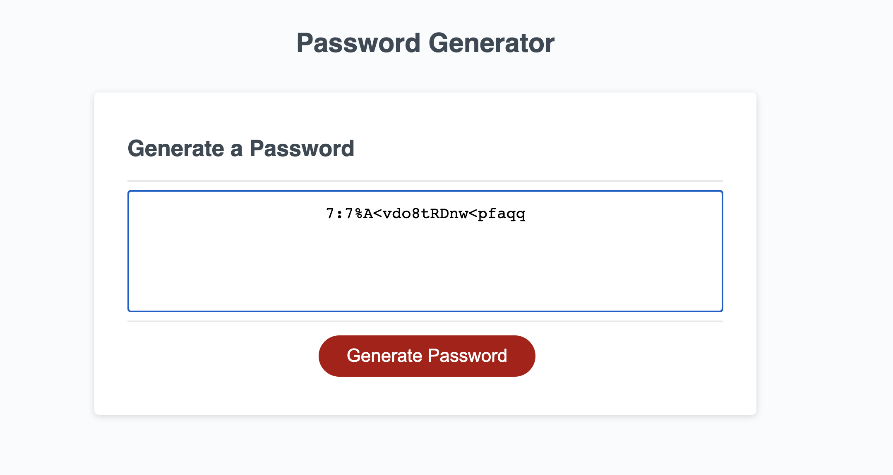

# Password-Generator

## Description
The point of this practice was to explore EchmaScript and get used to using the syntax and basics of it. I built a very basic password generator with a series of a few questions to gather the main criteria for the password. I struggled the most with worrying about scope and what variables to keep on global scope and which ones to keep locally, but after looking at a few examples, and getting some help from a TA I got my code working. I learned that It probably would've been better for me with this project to have started from scratch with the js file because I was trying too hard to make sure that 

## Usage
 To use this generator, all you need to do is press the button, 'generate password' then a prompt will pop up and ask how long you want your password to be, then you will be prompted to confirm whether or not you want specific characters in your password. Once you have gone through all the prompts, you will see your generated password pop up in the box.  
- Below is a picture of the example given:
   ,,,
    

- below is a picture of my work:
,,,
    

## Credits
I'd like to give credit to my professor and all of the TA's in my class for helping me through this practice. 
---
This homework project was created by the University of Washington and given through their coding bootcamp. 
© 2021 Trilogy Education Services, LLC, a 2U, Inc. brand. Confidential and Proprietary. All Rights Reserved.

